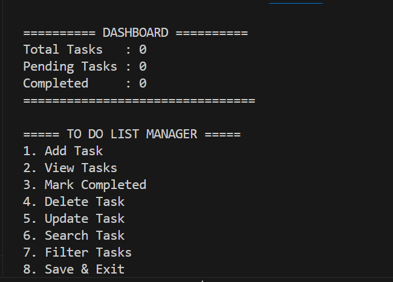
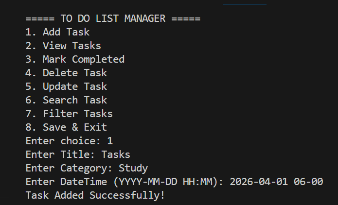
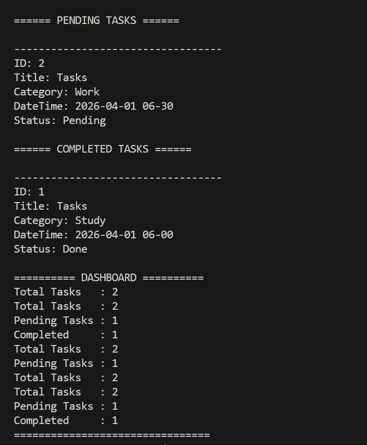
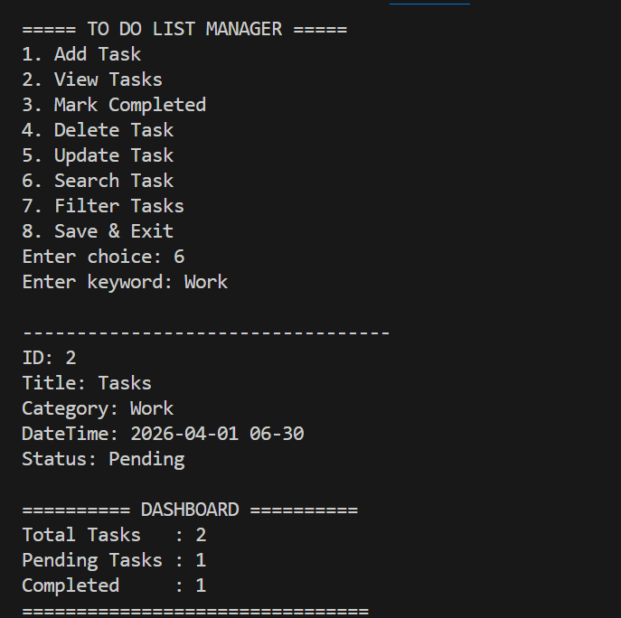
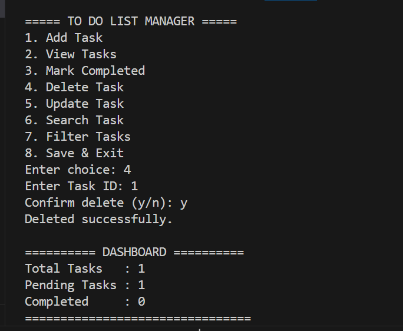

# To-Do-List-Manager

## 📌 Overview  
This project is a **Command-Line Based To-Do List Manager** developed in **C**. It enables users to efficiently manage daily tasks with features like task creation, updating, deletion, searching, and persistent storage.  

The application showcases core system-level programming concepts including **file handling, structured data management, and modular programming**.

---

## 🚀 Features  
- Add, update, and delete tasks  
- Mark tasks as completed or pending  
- Search tasks by title or category  
- Categorize tasks (Work, Study, Personal, etc.)  
- Detect scheduling conflicts (same date & time)  
- Persistent storage using file handling  
- Clean and structured CLI interface  

---

## 🧠 Concepts Used  
- Structures (`struct`)  
- File Handling (`fopen`, `fread`, `fwrite`)  
- String Manipulation (`strcpy`, `strcmp`, `strstr`)  
- Modular Programming  
- Array Management  
- Input Handling in C  

---

## 🖥️ Tech Stack  
- **Language:** C  
- **Interface:** Command Line Interface (CLI)  

---

## ▶️ How to Run
  **Compile the program:** gcc main.c -o todo
  **Run the executable:** ./todo

  ---
  
## 🎯 Learning Outcome
This project helped in understanding how low-level programming can be used to build practical applications with structured data handling and persistent storage.

---

## 🔗 Future Improvements

Reminder system using system time
Sorting tasks by priority or deadline
GUI-based version using libraries
Multi-user support

---

## 📸 Output Screenshots

### 🔹 Dashboard View
Displays an overview of total, pending, and completed tasks, providing a quick summary of task status.

### 🔹 Add Task
Interface for creating a new task with details such as title, category, and scheduled date-time, along with conflict detection.

### 🔹 View Tasks
Shows all tasks organized by status (pending and completed) and sorted chronologically for better tracking.

### 🔹 Filter Tasks
Allows users to quickly locate tasks based on keywords, category, or completion status.

### 🔹 Delete Tasks
Allows users to quickly locate tasks based on keywords, category, or completion status.

---
